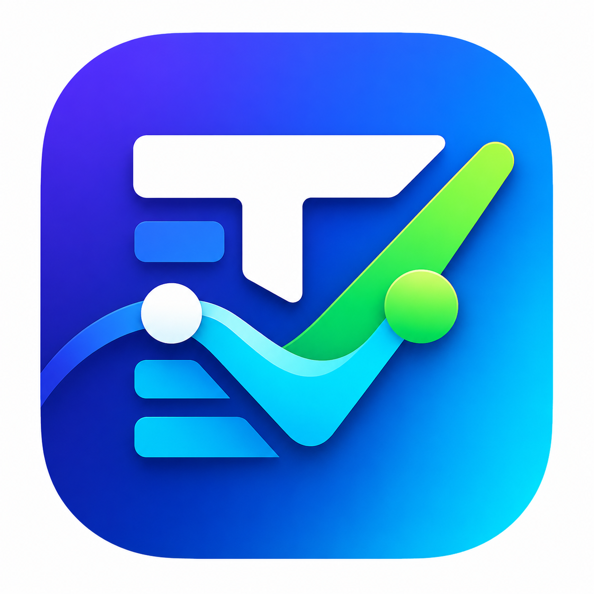

# TaskFlow 📝✨

<p align="center">
  
</p>


**TaskFlow** is an advanced, production-ready Todo application engineered with Flutter. It goes beyond the basic "to-do list" by offering robust local persistence, cloud synchronization, push notifications, and beautiful implicit animations. Designed as a blueprint for high-quality Flutter applications, it showcases the integration of SQFlite, Supabase, and Riverpod 3.0.

---

## 🚀 Key Features

*   **Complete CRUD Functionality**: Create, Read, Update, and Delete tasks instantly.
*   **Reactive State Management**: Powered by Riverpod's modern `AsyncNotifier` to ensure the UI perfectly syncs with the local database.
*   **Advanced Category Management**: Create custom categories with a color picker to organize tasks efficiently.
*   **Cloud Synchronization**: Seamlessly syncs local SQLite data with Supabase for cross-device access.
*   **Local Push Notifications**: Never miss a deadline with scheduled local push notifications using `flutter_local_notifications`.
*   **Beautiful Animations**: Implements fluid UX with `flutter_animate` staggered lists and Hero screen transitions.
*   **Priority Tiers**: Categorize tasks by Priority (Low, Medium, High). 
*   **Smart Filtering & Searching**: Instantly query tasks by title and filter by completion status.
*   **Dynamic Theme**: Fully leverages Flutter's **Material 3** guidelines (Light/Dark mode).

---

## 🛠 Tech Stack Deep Dive

*   **Framework:** [Flutter](https://flutter.dev/) (Dart)
*   **State Management:** [Riverpod 3.0](https://riverpod.dev/) (`flutter_riverpod`). Modern AsyncNotifier and code-generation ready approach for responsive and predictable states.
*   **Local Storage:** [SQFlite](https://pub.dev/packages/sqflite) with `path_provider`. Ensures tasks are immediately available completely offline.
*   **Cloud Backend:** [Supabase](https://supabase.com/) (`supabase_flutter`). Provides PostgreSQL functionality synced seamlessly in the background to ensure your data is always backed up and accessible.
*   **Animations:** [flutter_animate](https://pub.dev/packages/flutter_animate) for beautiful, declarative implicit animations, giving elements life directly from the widget tree.
*   **Notifications:** `flutter_local_notifications` combined with `timezone` for accurate, reliable scheduled alerts even when the app is completely closed.
*   **Utilities:** `intl` (Formatting dates), `uuid` (Generating secure unique identifiers), `flutter_colorpicker` (For visual category selection), `cupertino_icons` (Standard iOS/Apple icons).

---

## 🏗 Architecture & Design Patterns

The codebase strictly adheres to a **Feature-Driven Layered Architecture**. It isolates concerns, keeping the business logic out of the presentation layer, creating a testable and maintainable codebase.

### 1. Presentation Layer (UI)
Located under `lib/features/`. Widgets are built purely declaratively. They listen to the state via Riverpod's `ref.watch()` within `ConsumerStatefulWidget` or `ConsumerWidget`, avoiding `setState` wherever possible. 

### 2. State Management Layer (Notifiers)
Located under `lib/providers/`. It acts as the "Brain" of the application. Notifiers like `TaskNotifier` and `CategoryNotifier` extend `AsyncNotifier`. They sit between the UI and the repositories, handling loading, error, and data states natively.

### 3. Repository Layer
Located under `lib/repositories/`. 
*   `TaskRepository` & `CategoryRepository` orchestrate data. They read from and write to the local SQLite database.

### 4. Service Layer (Third-Party Integrations)
Located under `lib/core/services/`.
*   `SyncService`: Listens for changes and pushes CRUD operations silently to Supabase.
*   `NotificationService`: Handles interacting with iOS and Android OS-level push notifications to schedule and cancel alarms.

### 5. Data Source Layer (Database)
Located under `lib/core/database/`. `DatabaseHelper` is a **Singleton** managing the SQLite connection, creating tables, and handling schema migrations.

---

## 🗄️ Database Schema

### `tasks` Table
| Column | Type | Constraints | Description |
| :--- | :--- | :--- | :--- |
| `id` | TEXT | PRIMARY KEY | Generated UUID |
| `title` | TEXT | NOT NULL | Task title |
| `description` | TEXT | NULL | Optional extended notes |
| `dueDate` | TEXT | NULL | ISO8601 String representation of the date/time |
| `priority` | INTEGER | NOT NULL | `0` (Low), `1` (Medium), `2` (High) |
| `isCompleted` | INTEGER | NOT NULL | `0` (False), `1` (True) |
| `categoryId` | TEXT | FOREIGN KEY | Links to `categories` table (Nullable) |

### `categories` Table
| Column | Type | Constraints | Description |
| :--- | :--- | :--- | :--- |
| `id` | TEXT | PRIMARY KEY | Generated UUID |
| `name` | TEXT | NOT NULL | Category name |
| `color` | INTEGER| NOT NULL | Integer representation of Flutter Color |

---

## 📂 Comprehensive Project Structure

To help you understand how files connect, here is a detailed breakdown of the `lib/` directory:

```text
lib/
├── core/
│   ├── database/
│   │   └── database_helper.dart      <- Creates SQLite tables. Used by Repositories.
│   ├── services/
│   │   ├── notification_service.dart <- Schedules local OS push notifications. Used by providers when saving tasks.
│   │   └── sync_service.dart         <- Pushes local SQLite data to Supabase in the background. Used by Repositories.
│   └── theme/
│       └── app_theme.dart            <- Defines Material 3 colors, text styles, and components used across the app.
├── features/                         <- Feature-first grouping. Contains Presentation/UI logic.
│   ├── categories/
│   │   └── screens/
│   │       └── category_management_screen.dart <- Reads `category_provider.dart` to list, add, and manage categories.
│   └── tasks/
│       ├── screens/
│       │   ├── add_edit_task_screen.dart <- Reads `category_provider` (for dropdowns) and calls `task_provider` methods to save/update data.
│       │   └── home_screen.dart          <- Main dashboard. Watches `task_provider.dart` to show active/completed tasks.
│       └── widgets/
│           └── task_tile.dart            <- Reusable widget representing a single task. Used by `home_screen.dart`.
├── models/
│   ├── category.dart                 <- Data class defining a Category.
│   └── task.dart                     <- Data class defining a Task. Used universally across Providers, Repositories, and UI.
├── providers/                        <- State Management logic (Riverpod). The glue between UI and Repositories.
│   ├── category_provider.dart        <- Fetches `CategoryRepository`. Provides a list of categories to the UI.
│   └── task_provider.dart            <- Fetches `TaskRepository`. Handles business logic for adding/updating/completing tasks and updating UI state.
├── repositories/                     <- Abstracted Data Access layer.
│   ├── category_repository.dart      <- Connects to `database_helper.dart` for CRUD operations on the Categories table.
│   └── task_repository.dart          <- Connects to `database_helper.dart` for CRUD on Tasks table, and calls `sync_service.dart` and `notification_service.dart`.
└── main.dart                         <- Application Entry point. Initializes Riverpod ProviderScope, initializes Services, and runs the App.
```
